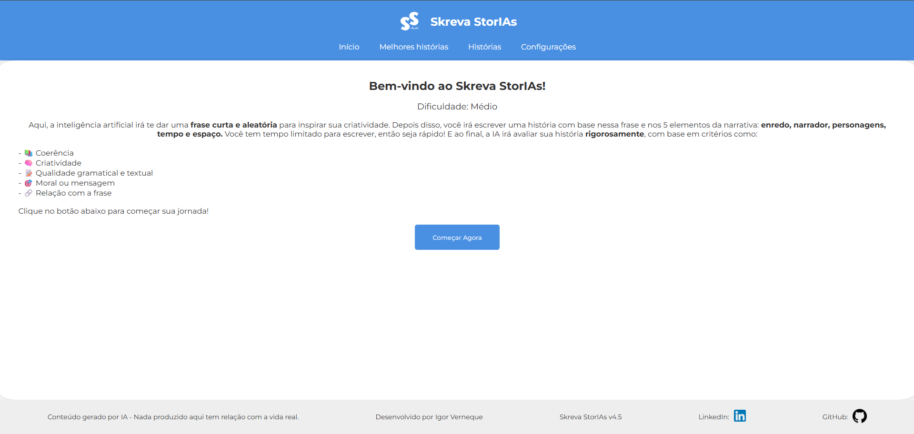

# 📖 Skreva StorIAs

Aplicativo web que estimula a **criação de histórias criativas** com o auxílio de inteligência artificial.

O *Skreva StorIAs* fornece ao usuário uma **frase inspiradora gerada por IA**, e a partir dela o usuário escreve uma narrativa baseada em cinco elementos da história (enredo, narrador, personagens, tempo e espaço). Ao final, o próprio sistema avalia a história com base em critérios como coerência, criatividade e qualidade textual.



## 🚀 Funcionalidades

* 🔹 Frase inspiradora gerada por IA para começar sua história  
* 📝 Editor de texto para escrever narrativas  
* 🧠 Avaliação automática da história por IA  
* 📊 Feedback com base em coerência, criatividade e gramática  
* 🌍 Interface web simples e funcional  

## 🛠️ Tecnologias utilizadas


## 📦 Instalação

Clone o repositório:

```bash
git clone https://github.com/IgorVernequeDev/Skreva-StorIAs.git
```

Entre na pasta do projeto:

```bash
cd Skreva-StorIAs
```

Instale as dependências:

```bash
pip install -r requirements.txt
```

Execute o projeto:

```bash
python run.py
```

Depois disso, acesse no navegador:
```bash
http://127.0.0.1:5000/
```

## 🎯 Objetivo do projeto

* Criar uma experiência de escrita criativa assistida por IA

* Estimular usuários a escrever narrativas completas

* Gerar feedback automático de qualidade textual

* Unir backend em Flask com interface web interativa

## 👨‍💻 Autor

Desenvolvido por **Igor Verneque**
